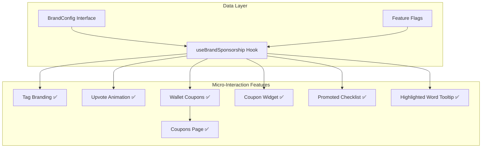

# Micro-Interaction Ads Platform

## Architecture Overview




## 1. Core Brand Configuration Types ✅

Create shared types in `[packages/shared/src/lib/brand.ts](packages/shared/src/lib/brand.ts)`:

```typescript
interface BrandConfig {
  id: string;
  name: string;           // "Copilot"
  slug: string;           // "copilot"
  colors: {
    primary: string;      // Brand primary color
    secondary: string;
    gradient?: string;
  };
  logo: string;           // Brand logo URL
  sponsoredTags: string[];  // ["ai", "copilot", "github"]
  
  // Feature-specific configs
  tagBranding?: TagBrandingConfig;
  upvoteAnimation?: UpvoteAnimationConfig;
  couponCampaign?: CouponCampaignConfig;
  promotedChecklist?: PromotedChecklistConfig;
  highlightedWord?: HighlightedWordConfig;
}
```

**Mock Brand Config (GitHub Copilot):**

```typescript
const MOCK_COPILOT_BRAND: BrandConfig = {
  id: 'copilot',
  name: 'GitHub Copilot',
  slug: 'copilot',
  colors: {
    primary: '#6e40c9',     // Copilot purple
    secondary: '#1f6feb',   // GitHub blue
    gradient: 'linear-gradient(135deg, #6e40c9 0%, #1f6feb 100%)',
  },
  logo: 'https://github.githubassets.com/images/icons/copilot/cp-head-square.png',
  sponsoredTags: ['ai', 'copilot', 'github', 'machine-learning'],
  // ... feature configs
};
```

## 2. Feature: Tag Branding ✅

**Files to modify:**

- `[packages/shared/src/components/tags/TagElement.tsx](packages/shared/src/components/tags/TagElement.tsx)`
- `[packages/shared/src/components/cards/common/PostTags.tsx](packages/shared/src/components/cards/common/PostTags.tsx)`

**Implementation:**

- Create `BrandedTag` wrapper component
- Animate tag text transition after 1 second delay
- Add brand suffix ("powered by Copilot") or brand arrow ("Copilot ->")
- Use framer-motion for smooth text transitions

```typescript
interface TagBrandingConfig {
  style: 'suffix' | 'replace' | 'arrow';  // "ai - powered by Copilot" | "#Copilot" | "#Copilot ->"
  delay: number;          // Animation delay in ms
  targetUrl?: string;     // Optional click-through URL
}
```

## 3. Feature: Greeting Sponsorship (REMOVED)

~~**Location:** Modify existing Log page greeting (`/log`)~~

**Status:** This feature was removed from the /log page. The greeting sponsorship types remain in the codebase for potential future use in other locations.

## 4. Feature: Branded Upvote Animation ✅

**Files to modify:**

- `[packages/shared/src/components/cards/common/UpvoteButtonIcon.tsx](packages/shared/src/components/cards/common/UpvoteButtonIcon.tsx)`
- `[packages/shared/src/hooks/vote/useVotePost.ts](packages/shared/src/hooks/vote/useVotePost.ts)`

**Implementation:**

- Add framer-motion for animation (already used in Log cards)
- Create particle/confetti effect using brand colors
- Trigger animation when upvoting posts with matching tags
- Animation options: confetti, ripple, burst, glow

```typescript
interface UpvoteAnimationConfig {
  type: 'confetti' | 'ripple' | 'burst' | 'glow';
  particleCount?: number;
  duration: number;
}
```

## 5. Feature: Wallet Coupons (External Store Codes) ✅

Brands can send **external discount codes** to users' wallets. Users copy these codes and redeem them on the brand's external store (e.g., "20% off Copilot Pro" redeemed at GitHub checkout).

**Files created:**

- `packages/shared/src/components/wallet/CouponCard.tsx` - Standalone coupon display card ✅
- `packages/shared/src/components/wallet/SponsoredCouponWidget.tsx` - Post modal sidebar widget ✅
- `packages/webapp/pages/settings/coupons.tsx` - Full coupons page with search & favorites ✅

**Files modified:**

- `[packages/webapp/pages/wallet.tsx](packages/webapp/pages/wallet.tsx)` - Integrated coupon section ✅
- `[packages/shared/src/components/ProfileMenu/sections/MainSection.tsx](packages/shared/src/components/ProfileMenu/sections/MainSection.tsx)` - Added coupons link ✅
- `[packages/shared/src/components/profile/ProfileSettingsMenu.tsx](packages/shared/src/components/profile/ProfileSettingsMenu.tsx)` - Added coupons menu item ✅

**Implementation:**

- Display coupon codes users can copy to clipboard
- Show brand logo, discount description, and expiration date
- "Redeem" button links to brand's external store
- Coupon states: active, used (self-reported), expired
- Toast notification when new coupon is received

```typescript
interface BrandCoupon {
  id: string;
  brandId: string;
  code: string;              // "COPILOT20" - the actual discount code
  description: string;       // "20% off Copilot Pro subscription"
  expiresAt: Date;
  redeemUrl: string;         // "https://github.com/copilot/checkout"
  termsUrl?: string;         // Link to terms & conditions
  isUsed: boolean;           // User marks as used (optional tracking)
}

interface CouponCampaignConfig {
  coupons: BrandCoupon[];
}
```

**UI Flow:**

1. Brand sends coupon to eligible users (via backend)
2. User sees notification: "You received a coupon from Copilot!"
3. Coupon appears in wallet under "My Coupons" section
4. User clicks "Copy Code" -> code copied to clipboard
5. User clicks "Redeem" -> opens brand's external store in new tab
6. User can optionally mark coupon as "Used"

**Additional Implementations:**

### Dedicated Coupons Page (`/settings/coupons`) ✅

A full-featured coupons management page in settings:

- **Search**: Filter coupons by company, category, title, or description
- **Favorites**: Star coupons to pin them to the top (persisted in localStorage)
- **Card Grid**: Responsive 2-column grid on tablet+
- **Modal Details**: Click coupon card to view full details with:
  - Copy code button
  - Step-by-step redemption instructions
  - Direct link to brand website
- **Mock Data**: 6 sample coupons (GitHub, JetBrains, Vercel, Notion, Figma, Linear)

### Post Modal Sidebar Widget (`SponsoredCouponWidget`) ✅

Shows contextual coupons in post modal sidebar when:

- Post has tags matching the active brand's sponsored tags
- Brand has active coupon campaign
- Coupon is not expired or used

Features:

- Brand-colored gradient border
- Copy code on click
- "Redeem at {domain}" CTA button

## 6. Feature: Promoted Checklist ✅

**Location:** Popover triggered by a promotional banner/button

**Files created:**

- `packages/shared/src/components/checklist/PromotedChecklist.tsx` - Main checklist UI with hero header, animated coins, progress bar ✅
- `packages/shared/src/components/checklist/PromotedChecklistBanner.tsx` - Promotional banner for sidebar/feed ✅
- `packages/shared/src/components/checklist/PromotedChecklistMenuItem.tsx` - Compact menu item variant ✅
- `packages/shared/src/hooks/usePromotedChecklist.ts` - State management with localStorage persistence ✅

**Leverage existing:**

- `[packages/shared/src/hooks/useChecklist.ts](packages/shared/src/hooks/useChecklist.ts)` - Checklist logic
- `[packages/shared/src/graphql/actions.ts](packages/shared/src/graphql/actions.ts)` - ActionType enum
- Existing popover patterns in the codebase

**Implementation:**

- Show a promotional banner in the feed or sidebar: "Complete the Copilot Challenge - Earn 500 Cores!"
- Clicking banner opens a popover with task list
- Each task has a "Verify" button (for prototype: mock verification with localStorage)
- Progress bar showing completed tasks
- Award cores via existing `AWARD_MUTATION` (mocked for prototype)

```typescript
interface PromotedChecklistConfig {
  title: string;          // "Copilot Challenge"
  description: string;    // "Complete tasks to earn cores"
  tasks: PromotedTask[];
  totalReward: number;    // Total cores for completion
}

interface PromotedTask {
  id: string;
  title: string;          // "Follow @GitHubCopilot on X"
  description?: string;
  reward: number;         // Cores awarded per task
  verifyUrl?: string;     // External link to complete task
  icon?: string;          // Task icon (e.g., X logo for follow task)
}
```

**Example tasks for Copilot:**

1. "Follow @GitHubCopilot on X" - 100 cores
2. "Try Copilot free for 30 days" - 200 cores
3. "Star the Copilot repo on GitHub" - 100 cores
4. "Share your Copilot experience" - 100 cores

## 7. Feature: Highlighted Word Tooltip ✅

**Location:** Post content, comments, article previews - anywhere text is displayed

**Files to create:**

- `packages/shared/src/components/brand/HighlightedWord.tsx` - Highlighted word with tooltip
- `packages/shared/src/components/brand/SponsoredTooltip.tsx` - Tooltip content with brand info

**Implementation:**

- Scan text content for configured keywords (e.g., "AI", "machine learning", "copilot")
- Wrap matched keywords with `HighlightedWord` component
- On hover/click, show a sponsored tooltip with brand info and CTA
- Tooltip includes: brand logo, short message, and optional action button
- Subtle highlight styling (dotted underline or background) to indicate sponsorship
- Track impressions and clicks for analytics

```typescript
interface HighlightedWordConfig {
  keywords: string[];           // Words to highlight (case-insensitive)
  tooltipTitle: string;         // "Powered by GitHub Copilot"
  tooltipDescription: string;   // "AI pair programming for developers"
  ctaText?: string;             // "Try Free" button text
  ctaUrl?: string;              // Click-through URL
  highlightStyle: 'underline' | 'background' | 'dotted';
  triggerOn: 'hover' | 'click' | 'both';
}
```

**Example configuration for Copilot:**

```typescript
highlightedWord: {
  keywords: ['AI', 'artificial intelligence', 'code completion', 'copilot'],
  tooltipTitle: 'GitHub Copilot',
  tooltipDescription: 'Your AI pair programmer. Write code faster with intelligent suggestions.',
  ctaText: 'Try Free for 30 Days',
  ctaUrl: 'https://github.com/features/copilot',
  highlightStyle: 'dotted',
  triggerOn: 'hover',
}
```

**UI Behavior:**

1. User reads post content containing keyword "AI"
2. "AI" appears with subtle dotted underline indicating it's interactive
3. On hover (or click based on config), tooltip appears above the word
4. Tooltip shows: Copilot logo, "Your AI pair programmer", and "Try Free" button
5. Clicking CTA opens brand URL in new tab
6. Tooltip has "Sponsored" label for transparency

**Integration points:**

- Post cards (title, description)
- Post page content
- Comments section
- Search results snippets

## 8. Central Hook: useBrandSponsorship ✅

Create `[packages/shared/src/hooks/useBrandSponsorship.ts](packages/shared/src/hooks/useBrandSponsorship.ts)`:

```typescript
const useBrandSponsorship = () => {
  const { value: brandConfig } = useConditionalFeature({
    feature: 'brand_sponsorship_config',
    shouldEvaluate: true,
  });
  
  return {
    activeBrand: brandConfig,
    getSponsoredTag: (tag: string) => /* ... */,
    getUpvoteAnimation: (postTags: string[]) => /* ... */,
    getCoupons: () => /* ... */,
    getPromotedChecklist: () => /* ... */,
    getHighlightedWordConfig: () => /* ... */,
    isKeywordHighlighted: (word: string) => /* ... */,
  };
};
```

## File Structure

```
packages/shared/src/
├── lib/
│   └── brand.ts                    # Brand types, mock data, and utilities ✅
├── hooks/
│   ├── useBrandSponsorship.ts      # Central brand hook ✅
│   └── usePromotedChecklist.ts     # Checklist state management ✅
├── components/
│   ├── brand/
│   │   ├── BrandedTag.tsx          # Tag branding with animation ✅
│   │   ├── BrandedTag.module.css   # Tag animation styles ✅
│   │   ├── BrandedUpvoteAnimation.tsx  # Confetti/particle animation ✅
│   │   ├── HighlightedWord.tsx     # Highlighted keyword with tooltip ✅
│   │   └── SponsoredTooltip.tsx    # Tooltip content component ✅
│   ├── checklist/
│   │   ├── PromotedChecklist.tsx       # Main checklist UI ✅
│   │   ├── PromotedChecklist.module.css # Checklist styles ✅
│   │   ├── PromotedChecklistBanner.tsx  # Promotional banner component ✅
│   │   ├── PromotedChecklistBanner.module.css # Banner styles ✅
│   │   ├── PromotedChecklistMenuItem.tsx # Menu item variant ✅
│   │   └── PromotedChecklistMenuItem.module.css # Menu item styles ✅
│   └── wallet/
│       ├── CouponCard.tsx          # Standalone coupon card ✅
│       └── SponsoredCouponWidget.tsx # Post modal sidebar coupon widget ✅

packages/webapp/
└── pages/
    ├── wallet.tsx                  # Modified for coupon section ✅
    └── settings/
        └── coupons.tsx             # Full coupons page with search & favorites ✅
```

## Design Considerations for Future Admin Panel

The `BrandConfig` interface is designed to be:

- Serializable to JSON for storage in backend
- Configurable via GrowthBook feature flags initially
- Migrated to dedicated admin API later

Admin panel would allow brands to:

- Upload logo and set brand colors
- Select which tags to sponsor
- Design upvote animations
- Create and distribute external store coupon codes to users
- Build promotional checklists with core rewards
- Configure highlighted keywords with custom tooltips and CTAs

